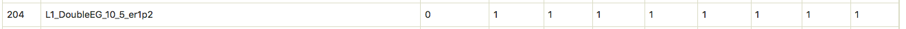
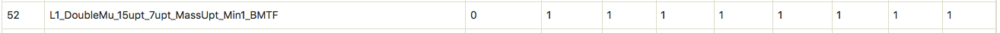
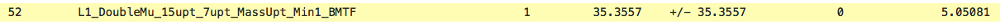
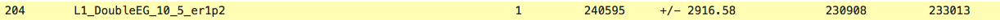
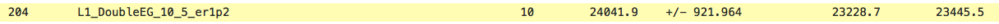
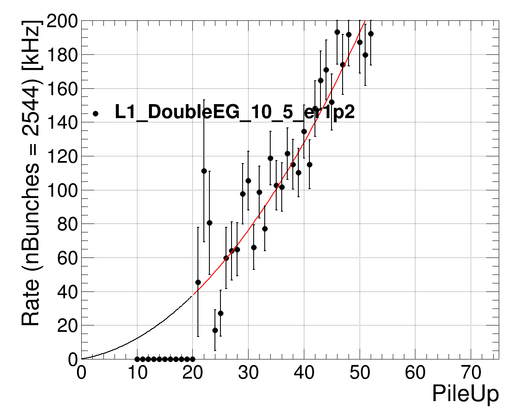
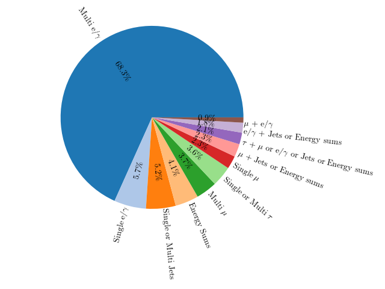

# L1 menu rate estimation

This tutorial will demonstrate how to set up the rate estimation tool and examples of how to prepare the L1 ntuple list and the PS tables with your new seed. We will go through an example command for estimating the L1 rate for a small number of events (20k) and at the end of the tutorial we will present examples of producing rate VS PU and a rate bar and pie charts. 

The idea of this hands-on session is to walk the participants through all the necessary steps for estimating the L1 menu rates produce the rate plots. The participants are encouraged to follow the live demonstration instead of trying to execute the steps by themself on real time.  
All the ingredients (ntuple list, PS tables) and the results (L1 rate tables with the full Run3 NuGun statistics and the rate VS PU and rate bar and pie charts) will be provided by us such that everyone can follow the steps offline.

## Setup instructions

Log in to Lxplus with your username.
```
ssh -X <username>@lxplus.cern.ch
```

Clone the L1MenuTools repo
```
cmsrel CMSSW_11_1_5
cd CMSSW_11_1_5/src/
git clone --depth 1 https://github.com/cms-l1-dpg/L1MenuTools.git
cd L1MenuTools/rate-estimation/
```

Get the XML menu file locally and translate it into C++ code
```
wget https://raw.githubusercontent.com/cms-l1-dpg/L1MenuRun3/master/development/L1Menu_Collisions2022_v0_1_1/L1Menu_Collisions2022_v0_1_1.xml  # alternatively: place your custom menu XML here
bash configure.sh L1Menu_Collisions2022_v0_1_1.xml  # alternatively: provide your custom menu XML
```
This step produces a ```menulib.hh``` and a ```menulib.cc``` files

Note: The command above brings and translates the baseline Run3 menu. For the purpose of this exercise we will get the modified menu and translate it to C++ code in a few steps

Compile
```
cmsenv
mkdir -p objs/include
make -j 8
```

Every time the menu is modified the last 4 steps should be repeated.

In order to get the modified menu that contains the new seed the steps are the following:
```
wget https://raw.githubusercontent.com/cms-l1-dpg/L1Tutorials/master/tutorials/rate-estimation/input/L1Menu_Collisions2022_v0_1_1_modified.xml
bash configure.sh L1Menu_Collisions2022_v0_1_1_modified.xml
cmsenv
mkdir -p objs/include
make -j 8
```

## Produce all the ingredients and estimate the L1 rates

### 1. Make ntuple list

The baseline L1 ntuple list of the Run3 NuGun ntuples is [here](https://github.com/cms-l1-dpg/L1Tutorials/blob/ratesAndPS/tutorials/rate-estimation/input/Run3_NuGun_MC_ntuples.list) 

For producing your own ntuple list the steps are the following: 
```
cd ./ntuple
./makeFileList.py path_to_ntuples > output_list_name.list
```

This creates a list of the paths of all the L1 ntuples

For example, if we want to recreate the Run3 NuGun ntuple list the steps are:
```
cd ./ntuple
./makeFileList.py /eos/cms/store/group/dpg_trigger/comm_trigger/L1Trigger/stempl/condor/menu_Nu_11_0_X_1614189426/ > testNuGun.list
```


### 2. Make prescale table

The PS table for our modified menu is [here](https://github.com/cms-l1-dpg/L1Tutorials/blob/master/tutorials/rate-estimation/input/PrescaleTable-1_L1Menu_Collisions2022_v0_1_1_modified.csv)

In order to create this new PS table that contains the PS columns for the new seeds from scratch, the steps to follow are: 
```
cd /L1MenuTools/pstools
bash run-ps-generate.sh https://github.com/cms-l1-dpg/L1Menu2018/raw/master/official/PrescaleTables/PrescaleTable-1_L1Menu_Collisions2018_v2_1_0.xlsx https://raw.githubusercontent.com/cms-l1-dpg/L1Tutorials/master/tutorials/rate-estimation/input/L1Menu_Collisions2022_v0_1_1_modified.xml --output PrescaleTable-1_L1Menu_Collisions2022_v0_1_1_modified
mv PrescaleTable-1_L1Menu_Collisions2022_v0_1_1_modified.csv ../rate-estimation/menu/
```                                                                                                                                                                             
Firstly, you have to provide an already existing PS table (in xlsx format) and then you have to provide the menu that contains your new seeds.

The available options are
* --newSeedPS: specifies the number of PS to use for the new seeds, by default PS of the new seeds is set to 1
* --includeBptx: PS is set to zero for trigger seeds using Bptx and NoBptx due to problems in emulation

   **I. How can you set PS = 2 to all the new seeds?**
   <details>
   <summary>Answer: (Click to expand!)</summary>

   Adding the --newSeedPS 2 in the command above.
   </details>


   **II. What PS should I use when I start my L1 seed rate studies?**
   <details>
   <summary>Answer: (Click to expand!)</summary>

   For the beggining of your study we suggest you set the PS of your new seed to 1. This way you can check the initial rate of your seed and then study how you can control it by increasing the PS.
   </details>

The PS of the new seeds are:
* ```L1_DoubleEG_10_5_er1p2``` is [here](https://github.com/cms-l1-dpg/L1Tutorials/blob/master/tutorials/rate-estimation/input/PrescaleTable-1_L1Menu_Collisions2022_v0_1_1_modified.csv#L160)
    

* ```L1_DoubleMu_15upt_7upt_MassUpt_Min1_BMTF``` is [here](https://github.com/cms-l1-dpg/L1Tutorials/blob/master/tutorials/rate-estimation/input/PrescaleTable-1_L1Menu_Collisions2022_v0_1_1_modified.csv#L48)
    


### 3. Estimate the L1 rate

Let's see how to run the rate tool for a small number of events (20k) and estimate the rate of our new menu
```
cd /L1MenuTools/rate-estimation
./testMenu2016 -m menu/PrescaleTable-1_L1Menu_Collisions2022_v0_1_1_modified.csv -l ntuple/Run3_NuGun_MC_ntuples.list -o testoutput_modified_PS1_20k -b 2544 --doPlotRate --maxEvent 20000 --SelectCol 2E+34 --doPrintPU
```
If you are using data remember to add the LS table. The baseline LS table is [here](https://github.com/cms-l1-dpg/L1MenuTools/blob/master/rate-estimation/menu/run_lumi.csv).
Instructions on how to prepare your LS table are [here](https://twiki.cern.ch/twiki/bin/viewauth/CMS/HowToL1TriggerMenu#3_Run_3_setting).

The rate estimation tool will output the rate table in txt and csv format and a root file with the rates of the L1 seeds vs pT and eta. 
All these files can be found [here](https://github.com/cms-l1-dpg/L1Tutorials/tree/ratesAndPS/tutorials/rate-estimation/results/).
Additionally a [testoutput\_modified\_PS1\_PU.csv](https://raw.githubusercontent.com/cms-l1-dpg/L1Tutorials/ratesAndPS/tutorials/rate-estimation/results/testoutput_modified_PS1_PU.csv) is produced if the ```--doPrintPU``` is used. This contains the seed names, PU bins, total events, PS value and number of events fired the trigger in every PU bin. This file will be used for the rate VS PU plotting.

   **III. How many events should I run for my studies?**
   <details>
   <summary>Answer: (click to exand)</summary>

   As many as possible! Here we demostrate only a small number of events due to time constraints. The rate tables in the results directory have been produced with the full stats of the Run3 NuGun MC sample.
   </details>

Now let's have a look at the results when running on the full stats Run3 NuGun samples

   **IV. What are the pure and proportional rates of the new seeds?** 
   <details>
   <summary>Answer: (Click to expand!) </summary>

   For the ```L1_DoubleMu_15upt_7upt_MassUpt_Min1_BMTF``` is [here](https://github.com/cms-l1-dpg/L1Tutorials/blob/ratesAndPS/tutorials/rate-estimation/results/testoutput_modified_PS1_FullStats.txt#L400) 

   

   and for the ```L1_DoubleEG_10_5_er1p2``` is [here](https://github.com/cms-l1-dpg/L1Tutorials/blob/ratesAndPS/tutorials/rate-estimation/results/testoutput_modified_PS1_FullStats.txt#L512)
   
   
   </details>


   **V. How much is the effective contribution of every seed to the total rate?**
   <details>
   <summary> Answer: (click to exand) </summary>

   * The ```L1_DoubleMu_15upt_7upt_MassUpt_Min1_BMTF``` has a pure rate = 0. 
   * The ```L1_DoubleEG_10_5_er1p2``` has pure rate = 230908 Hz.
   </details>


   **VI. How can we control the rate of the ```L1_DoubleEG_10_5_er1p2``` seed?**
   <details>  
   <summary> Answer: (click to expand)</summary>

   Possible options for controlling very high rates of seeds are the optimizing the cuts of the seeds and/or the increasing the PS
   </details>


   **VII. How does the rate change if the PS for ```L1_DoubleEG_10_5_er1p2``` is set to 10?**
   <details> 
   <summary> Answer: (Click to expand!) </summary>

   We made a new PS table, set the PS=10 for the new seeds which can be found [here](https://github.com/cms-l1-dpg/L1Tutorials/blob/ratesAndPS/tutorials/rate-estimation/input/PrescaleTable-1_L1Menu_Collisions2022_v0_1_1_modified_PS10.csv) and run the rate estimation tool again for the rull Run3 NuGun Stats.
   The results are [here](https://github.com/cms-l1-dpg/L1Tutorials/blob/ratesAndPS/tutorials/rate-estimation/results/testoutput_modified_PS10.txt#L512)
   The rate of the ```L1_DoubleEG_10_5_er1p2``` is decreased by 1/10 (as expected)

   
   </details>

### 4. Get the full stats result files (optional)
  
In order to get the result files of running on the full statistics of the Run3 NuGun sample you can follow the steps:
```
cd /L1MenuTools/rate-estimation/results
wget https://raw.githubusercontent.com/cms-l1-dpg/L1Tutorials/ratesAndPS/tutorials/rate-estimation/results/testoutput_modified_PS1_FullStats.csv
wget https://github.com/cms-l1-dpg/L1Tutorials/blob/ratesAndPS/tutorials/rate-estimation/results/testoutput_modified_PS1_FullStats.root
wget https://raw.githubusercontent.com/cms-l1-dpg/L1Tutorials/ratesAndPS/tutorials/rate-estimation/results/testoutput_modified_PS1_FullStats.txt
wget https://raw.githubusercontent.com/cms-l1-dpg/L1Tutorials/ratesAndPS/tutorials/rate-estimation/results/testoutput_modified_PS1_FullStats_PU.csv
``` 


### 5. Rates vs PU and rate visualization plots


For the rate vs PU plot production the ```--doPrintPU``` should be passed as argument in the previous step.
Before running the python command, open ```CompPUDep.py``` and add ```"L1_DoubleEG_10_5_er1p2" : "L1_DoubleEG_10_5_er1p2"``` in line 83
```
cd /L1MenuTools/rate-estimation/plots
python CompPUDep.py --outfolder RatesVSPU --csv ../results/testoutput_modified_PS1_20k_PU.csv
```
or for producing the plots with the full stats:
```
cd /L1MenuTools/rate-estimation/plots
python CompPUDep.py --outfolder RatesVSPU --csv ../results/testoutput_modified_PS1_FullStats_PU.csv
```

The rate vs PU plot with the full stats looks like 

and can be found [here](https://github.com/cms-l1-dpg/L1Tutorials/tree/ratesAndPS/tutorials/rate-estimation/Plots_RatesVSPU)

For the rate visualization plots (bar and pie charts)
```
cd /L1MenuTools/rate-visualization
bash run-visualize.sh --rateTable ../rate-estimation/results/testoutput_modified_PS1_20k.csv --output rate_visual --textOnBarPlot percentage+rates+totalrate

```
or for producing the plots with the full stats:
```
cd /L1MenuTools/rate-visualization
bash run-visualize.sh --rateTable ../rate-estimation/results/testoutput_modified_PS1_FullStats.csv --output rate_visual --textOnBarPlot percentage+rates+totalrate

```

The rate bar chart with the full stats looks like 


The pie chart looks like 


and both of them can be found [here](https://github.com/cms-l1-dpg/L1Tutorials/blob/ratesAndPS/tutorials/rate-estimation/Rate_Visual/)

