# TME tutorial: Exercise 1 (`L1_DoubleEG_10_5_er1p2`)

The goal of this exercise is to extend the latest Run-3 development L1 menu XML file
with the seed `L1_DoubleEG_10_5_er1p2`, which is based on a similar seed that already exists in the L1 menu, using the Trigger Menu Editor (TME).

**Go through the following instructions step by step and try to find answers to each of the posed questions. If you can't find some solutions on your own, get some help by reading the provided hints.**

## Getting ready

Make sure you are working in the correct directory and have the `tme` virtual
environment activated.
```
cd L1Tutorials/tutorials/tme-seed-development/
. tme/bin/activate
```

Now, open the latest Run-3 development menu with the TME:
```
tm-editor input/L1Menu_Collisions2022_v0_1_1.xml
```

The TME window should open and reveal the contents of the L1 menu XML file:
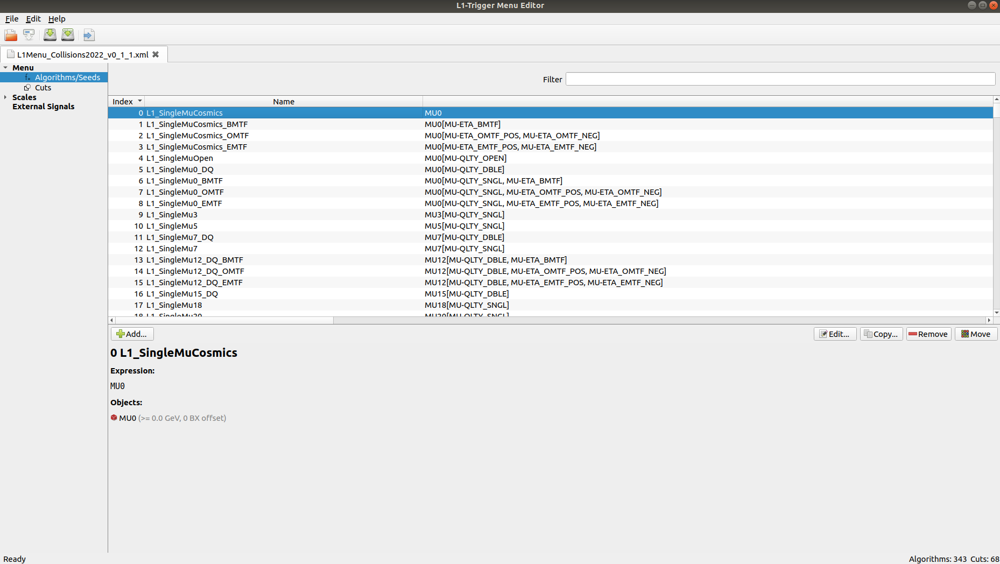

## Develop your seed

> If you want to start from scratch at any point, close your TME, and reset your L1 Menu XML file with ```git checkout -- input/L1Menu_Collisions2022_v0_1_1.xml```

1. **Find the seed** `L1_DoubleEG_15_10_er2p5`**. Which seed number does it have?**
    <details>
    <summary>Hint: How to find seeds? (Click to expand!)</summary>

    A seed can be found many ways. The easiest method is to search for it using
    the "Filter" field above the seed list (in the top right area, above the seed list).
    </details>


    <details>
    <summary>Solution (click to expand)</summary>

    The seed `L1_DoubleEG_15_10_er2p5` has the number 205.

    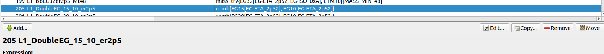
    </details>

1. **Make a copy of** `L1_DoubleEG_15_10_er2p5` **and place it at the nearest free seed index.**
    1. **What is the nearest free seed index?**
        <details>
        <summary>Hint: How to identify free seed indices?</summary>

        You don't necessarily have to look for free seed indices by eye. The TME can help you identify the occupation status of indices. Try to look out for that TME feature. (See the next hint if you can't find it.)
        </details>

        <details>
        <summary>Hint: How to make copies of seeds at free seed indices?</summary>

        Click the source seed `L1_DoubleEG_15_10_er2p5`. In the detailed view that appeared in the lower half of the TME window, click "Copy".

        

        A copy dialog will open. The field "Index" contains the target seed index. You can use the "Select index" button  next to the field to identify the nearest free index.
        </details>

        <details>
        <summary>Solution (click to expand)</summary>

        The nearest free seed index is 204. Here is where we place the seed copy.

        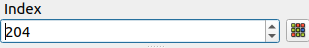

        The resulting seed copy should appear above the original seed:

        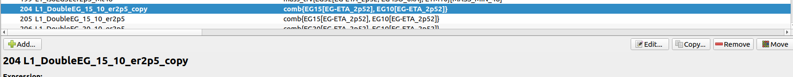
        </details>

1. **Now, modify the copied seed. The goal is to implement the seed** `L1_DoubleEG_10_5_er1p2`**. Let's take it one step at a time:**
    1. Find the copied seed (currently named `L1_DoubleEG_15_10_er2p5_copy`), click on it. Open the "Algorithm Editor" window by clicking the "Edit" button.

        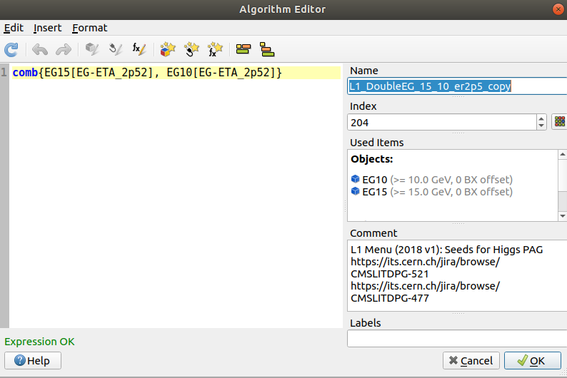

        First, take care of properly naming, commenting and categorizing the new seed.
        * **Rename the seed using the "Name" field:** `L1_DoubleEG_10_5_er1p2`.

            
        
            > This name already indicates the target configuration of the new seed - a "DoubleEG" seed with p<sub>T</sub> thresholds of 10 GeV and 5 GeV for each EG object, plus the "eta restriction" |eta| < 1.2 for the EG objects.

        * **In the comment field, add "Custom seed developed during the L1 seed development tutorial."**

            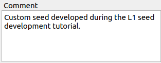

            > Each new seed must contain some short description (in a real-life scenario, also including the link to all corresponding JIRA tickets).

        * **Assign one or more labels to the seed using the "Label" field. Since this is a tutorial, let's just assign the label "test" to this seed.**

            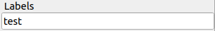

            > The minimum requirement for seed labels is (1) the targeted physics group ("HIG", "EXO", "SUSY",...), (2) whether the seed is intended for physics data taking ("physics") or for technical purposes (e.g., "calibration"), and (3) whether it is a "main" or "backup" seed.

    1. **Now, proceed with editing the seed logic. For this, we switch our focus on the panel that contains the logical expression** `comb{EG15[EG-ETA_2p52], EG10[EG-ETA_2p52]}`.

        * **Change the p<sub>T</sub> threshold of the first EG object from 15 GeV to 10 GeV.**
            <details>
            <summary>Hint: What is the first EG object?</summary>

            The first EG object appears as the string "EG15[EG-ETA_2p52]".
            The object itself is represented by "EG15", while the string in the square brackets encodes the extra requirements applied to the EG object.
            By convention, the numerical value attached to the object is the imposed minimum-p<sub>T</sub> requirement.
            </details>

            <details>
            <summary>Hint: Changing object properties</summary>

            The most transparent way to change object properties is to (1) put the cursor on the object by clicking somewhere within the "EG15" string

            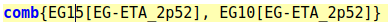
            
            and (2) then use the "Edit Object" button  in the menu.

            The "Object Requirement Editor" window opens. Find the field that reads "15.0 GeV" and adjust its value to "10.0 GeV". Confirm by clicking "OK".

            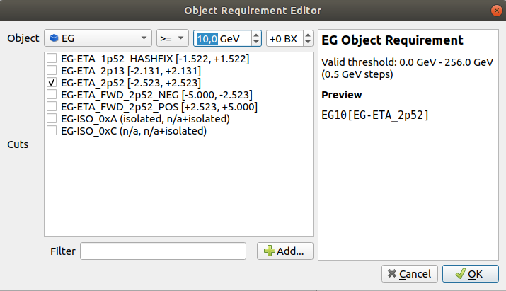
            </details>
            
            <details>
            <summary>Solution (click to expand)</summary>

            The logical expression should now read
            ```
            comb{EG10[EG-ETA_2p52], EG10[EG-ETA_2p52]}
            ```
            (i.e., `EG15` of the first EG object changed into `EG10`).
            </details>

        * **Change the p<sub>T</sub> threshold of the second EG object from 10 GeV to 5 GeV.**
            <details>
            <summary>Solution (click to expand)</summary>

            The procedure of changing the second EG object properties is analogous to the the previous step.

            Now that you already know how the logical expression should change, you could also just "type" your changes directly into the logical expression string.

            In any case, the updated expression should now read
            ```
            comb{EG10[EG-ETA_2p52], EG5[EG-ETA_2p52]}`
            ```

        * **Change the eta restriction settings for both EG objects.** You will need to add a new "Cut" named "er1p2" when editing the seed with the "Object Requirements Editor".
            <details>
            <summary>Hint: What is the eta restriction of this seed?</summary>

            By convention, eta restriction of L1 seeds are denoted as "er", followed by a numerical value ("2p52" means "2.52"). These requirements restrict the pseudorapidity range a given object can fall into.

            In our example seed, the eta restriction is "er2p52", corresponding to requirement |eta| < 2.52.
            </details>

            <details>
            <summary>Hint: Steps required for changing a cut</summary>

            In order to change a cut, it is generally not sufficient to simply modify its string expression. Instead, one needs to create a new "Cut", which is a separate "object" that encodes the cut properties (variable and thresholds) and which is identified via a unique name.
            
            Such a "Cut" appears in the list of cuts:

            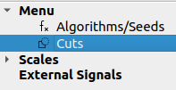

            New cuts can be created either in the "Cuts" section of a given L1 menu XML or "on-the-fly" during seed development (see the next hint for more details).
            </details>

            <details>
            <summary>Hint: Adding new cuts on the fly</summary>

            New cuts can be added on the fly by opening the "Object Requirements Editor" (by putting the mouse cursor on top of the "EG-ETA_er2p5" expression and clicking the the "Edit Object" button) and subsequently pushing the "Add" button in the bottom center of the window.

            The "Add" button opens the "Cut Editor". In its left panel, toggle "EG" and select the "ETA" cut type. Assign the suffix "er1p2" using the name field in the top center. Now use the up/down buttons to adjust the minimum and maximum values of this |eta| requirement.
            > The nearest available threshold is -1.218 and +1.218. At L1, the values of variables are discrete and cannot assume any arbitrary value from the continuum.

            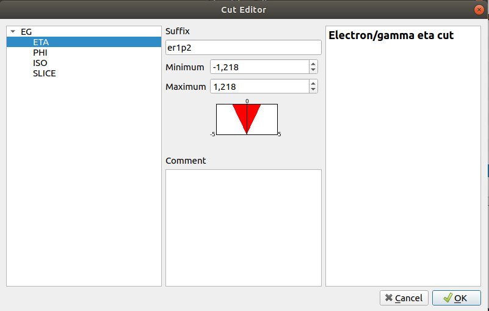

            Finally, click "OK" and select the new cut from the list in the Object Requirements Editor. Confirm with "OK".

            For the second EG object, the "er1p2" cut does not need to be created again. Just identify it in the cut list in the Object Requirements Editor and select it.
            </details>

            <details>
            <summary>Solution (click to expand)</summary>

            The logical expression should now read
            ```
            comb{EG10[EG-ETA_1p2], EG5[EG-ETA_1p2]}`
            ```
            Also, the corresponding cut "EG-ETA_1p2" should be contained in the list of Cuts of the L1 menu XML. You can close the Algorithm Editor by clicking "OK" and check the "Cuts" in the menu on the left.

            
            </details>

## Solution to Exercise 1

If you followed the above steps correctly, you should find a new seed named `L1_DoubleEG_10_5_er1p2` in the L1 menu seed list with the following summary of properties:

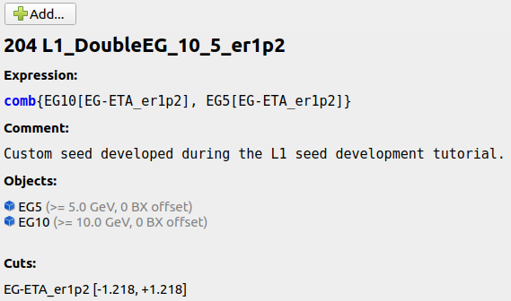

Additionally, a new "Cut" with the name "EG-ETA_er1p2" must be contained in your L1 menu cuts collection:
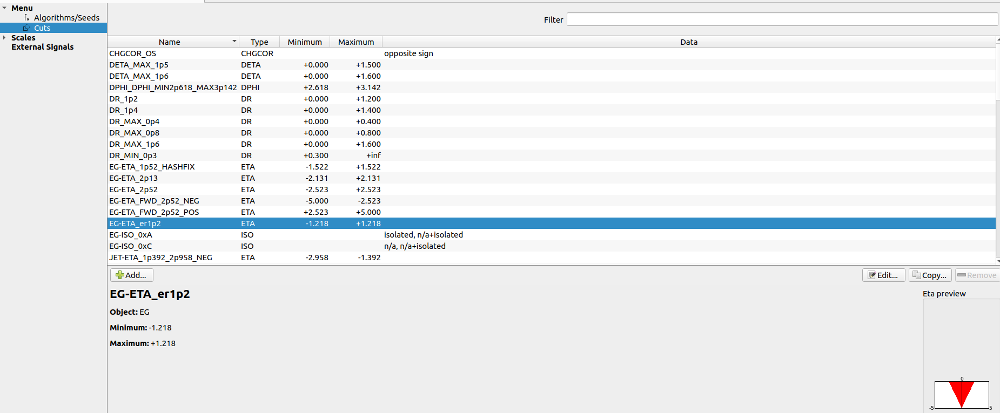

**Congratulations, you just completed Exercise 1!**

Time to save () your L1 menu XML file!

Next up: [Exercise 2](exercise-2.md)

