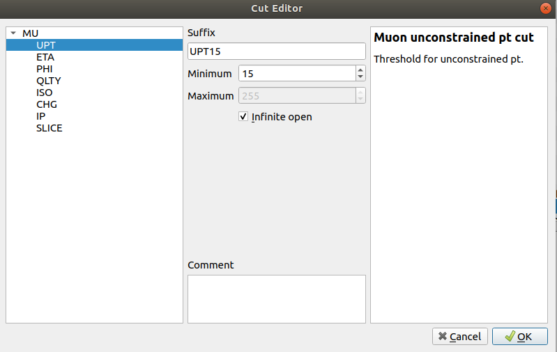

# TME tutorial: Exercise 1 (`L1_DoubleMu_15upt_7upt_MassUpt_Min1_BMTF`)

The goal of this exercise is to extend the latest Run-3 development L1 menu XML file
with the seed `L1_DoubleMu_15upt_7upt_MassUpt_Min1_BMTF`, which is based on a similar seed that already exists in the L1 menu, using the Trigger Menu Editor (TME).

This exercise assumes some of the knowledge acquired during the [first exercise](exercise-1.md) and will mainly focus on new concepts that are required for the development of this particular "DoubleMu" seed. If you haven't gone through the previous exercise, it is recommended to do so before proceeding here.

**Go through the following instructions step by step and try to find answers to each of the posed questions. If you can't find some solutions on your own, get some help by reading the provided hints.**

## Getting ready

If you have your custom L1 menu XML opened in the TME from the previous exercise, you are ready to start this exercise. Otherwise follow the next steps to open the XML file in the appropriate environment.

Make sure you are working in the correct directory and have the `tme` virtual
environment activated.
```
cd L1Tutorials/tutorials/tme-seed-development/
. tme/bin/activate
```

Now, open the latest Run-3 development menu with the TME:
```
tm-editor input/L1Menu_Collisions2022_v0_1_1.xml
```

## Develop your seed

> If you want to start from scratch at any point, close your TME, and reset your L1 Menu XML file with ```git checkout -- input/L1Menu_Collisions2022_v0_1_1.xml```

1. **Find the seed** `L1_DoubleMu_15_7_Mass_Min1`**. Which seed number does it have?**
    <details>
    <summary>Solution (click to expand)</summary>

    The seed `L1_DoubleMu_15_7_Mass_Min1` has the number 50.

    
    </details>

1. **Make a copy of** `L1_DoubleMu_15_7_Mass_Min1` **and place it at the nearest free seed index.**
    <details>
    <summary>Solution (click to expand)</summary>

    The nearest free seed index is 50. Here is where we place the seed copy.
    The resulting seed copy should appear below the original seed:

    
    </details>

1. **Now, modify the copied seed. The goal is to implement the seed** `L1_DoubleMu_15upt_7upt_MassUpt_Min1_BMTF`**. Before proceeding, let us dissect this seed:**
    * `DoubleMu`: The target seed involves two muon objects.
    * `15upt_7upt`: These are the p<sub>T</sub> thresholds for the two muon objects (15 GeV and 17 GeV, respectively). The suffixes "upt" indicate that the p<sub>T</sub> are *not* applied to the default vertex-constrained p<sub>T</sub> measurement, but to the vertex-unconstrained p<sub>T</sub> measurement.
    * `MassUpt_Min1`: There is a requirement on the invariant mass of the two muon objects: Their reconstructed mass must be 1 GeV or larger (`Min1`). Again, the "Upt" suffix in `MassUpt` indicates that the mass is reconstructed from the vertex-unconstrained muons instead of the default L1 mass measurement using the vertex-constrained muon objects.
    * `BMTF`: For the moment, we restrict this L1 seed to the "Barrel Muon Track Finder" (BMTF) because the UPT-type muon reconstruction is not available in all muon-system regions yet. The BMTF restriction is achieved by applying an appropriate |eta| restriction.

    *Evidently, the targeted L1 seed is the "UPT version" of the existing `L1_DoubleMu_15_7_Mass_Min1`.*

    Now, let's modify the copied seed one element at a time.

    1. Find the copied seed (currently named `L1_DoubleMu_15upt_7upt_MassUpt_Min1_BMTF_copy`), click on it. Open the "Algorithm Editor" window by clicking the "Edit" button.

        

        Like in the previous exercise, let's first take care of properly naming, commenting and categorizing the new seed.
        * **Rename the seed using the "Name" field:** `L1_DoubleMu_15upt_7upt_MassUpt_Min1_BMTF`.

        * **In the comment field, add "Custom seed developed during the L1 seed development tutorial."**

            > Each new seed must contain some short description (in a real-life scenario, also including the link to all corresponding JIRA tickets).

        * **Assign one or more labels to the seed using the "Label" field. Since this is a tutorial, let's just assign the label "test" to this seed.**

            > The minimum requirement for seed labels is (1) the targeted physics group ("HIG", "EXO", "SUSY",...), (2) whether the seed is intended for physics data taking ("physics") or for technical purposes (e.g., "calibration"), and (3) whether it is a "main" or "backup" seed.

        This is what your Algorithm Editor should show now:    
        

    1. **Next, let's proceed with editing the seed logic. For this, we switch our focus on the panel that contains the logical expression** `mass_inv{MU15, MU7}[MASS_MIN_1]`.

        This logical expression can be understood as follows:
        * `mass_inv{OBJ1, OBJ2}[FUNCTIOIN_CUT]`: The function `inv_mass` computes the invariant mass of the two objects `OBJ1` and `OBJ2`. Eventually, a cut `FUNCTION_CUT` is applied to the calculated invariant-mass value. The `FUNCTION_CUT` is a pre-defined TME "Cut" object.
        * `MU15` and `MU7`: These are the muon objects from which the invariant mass is computed. The muon objects themselves must fulfill some requirements (in this particular case, their vertex-constrained p<sub>T</sub> values must be larger than the respective thresholds of 15 GeV and 7 GeV. There are no other requirements for these muon objects.

        *Let's start editing now...*

        1. **Changing the muon p<sub>T</sub> requirements (vertex-constrained p<sub>T</sub> &rightarrow; vertex-*unconstrained* p<sub>T</sub>):**

            > IMPORTANT NOTE: The default p<sub>T</sub> measurement is based on the vertex-constrained reconstruction. A muon's vertex-constrained p<sub>T</sub> value is an intrinsic property of the L1 muon object. In contrast, the vertex-unconstrained p<sub>T</sub> is a "cut" in the TME (for technical reasons). Therefore, to cleanly replace the default vertex-constrained p<sub>T</sub> of a muon with the vertex-unconstrained p<sub>T</sub>, one needs to set the object p<sub>T</sub> to zero and apply a "UPT" cut of the given p<sub>T</sub> threshold to the same muon object. In our current example, `MU15` must be changed into `MU0[MU-UPT15]` (where `MU-UPT15` is a pre-defined TME Cut).

            <details>
            <summary>Hint: Changing the object p<sub>T</sub> threshold (vertex-constrained p<sub>T</sub>)</summary>

            To change the default p<sub>T</sub> of the muon object in the Algorithm Editor, place your cursor on top of the string expression `MU15` and click the "Edit Object" button .

            Set the muon minimum-p<sub>T</sub> to zero and confirm with "OK".

            
            </details>

            <details>
            <summary>Hint: Adding a cut on unconstrained p<sub>T</sub> ("UPT")</summary>

            Adding an extra cut to the muon object is similar to adding the eta-restriction cut to the "DoubleEG" seed from the previous exercise. Only this time, we put acut on the "UPT" quantity of a muon object.

            A suitable "MU-UPT" cut does not yet exist in the L1 menu XML, so we need to create one. This can be done on-the-fly by clicking the "Add" button in the Object Requirements Editor for the newly-updated `MU0` object:

            

            The Cut Editor opens. We need to select "MU" &rightarrow; "UPT" and create a UPT Cut with a minimum unconstrained-p<sub>T</sub> threshold of 15 GeV. The assigned named should be "UPT15":

            

            The Cut Editor opens. We need to select "MU" &rightarrow; "UPT" in the leftmost panel and create a UPT Cut with a minimum unconstrained-p<sub>T</sub> threshold of 15 GeV. The assigned named should be "UPT15":

            After confirming with "OK", the new cut "MU-UPT15" is applied to the `MU0` object:

            

            Now, repeat the same procedure to replace the 7-GeV vertex-constrained p<sub>T</sub> with a 7-GeV cut on the vertex-unconstrained p<sub>T</sub> (`MU-UPT_UPT7`).
            </details>
            
            <details>
            <summary>Solution (click to expand)</summary>
            
            The result of changing the p<sub>T</sub> requirements for both muon objects should look like this:

            
            </details>


        1. **Changing the invariant-mass function:**

            Functions in the TME, like `mass_inv`, can changed with the TME Function Editor. To open it, put your cursor on the "mass_inv" string expression and click the "Edit function" button 

            The Function Editor opens:

            

            Now, all we need to do is to switch out the function (`mass_inv` &rightarrow; `mass_inv_upt`) and assign a new function cut to it.

            > Note: Before implementing a seed that utilizes novel functions (like "mass_inv_3" or "mass_inv_dr"), make sure that all downstream tools already support those functions (e.g., check menu tools status [here](https://twiki.cern.ch/twiki/bin/view/CMS/SWGuideL1TriggerMenuTools#Integration_status_of_new_Run_3)). If in doubt, please contact the L1 menu team in due time.

            <details>
            <summary>Hint: Switching functions</summary>

            Switching functions is as easy as selecting them from the "Function" drop-down menu. For our purposes, we need the function "mass_inv_upt" instead of "mass_inv":

            
            </details>

            <details>
            <summary>Hint: Adding a function cut</summary>

            After switching the function type to `mass_inv_upt`, we do not find an appropriate function cut in the "Cuts" list. (Remember: We want to implement a 1-GeV minimum mass requirement.)

            So, just like in any other scenario when we needed a new cut, we open the Cut Editor by clicking the "Add" button.

            In the left panel, select "Functions" &rightarrow; "MASSUPT" and create a cut named "MASSUPT1" with a lower threshold of 1 GeV. The targeted cut configuration is the following:

            

            Confirm with "OK" and make sure the new cut is selected for our new seed in the Function Editor.
            </details>

            <details>
            <summary>Solution (click to expand)</summary>

            After the successful modification of the invariant-mass function, the resulting seed configuration should look like this:

            
            </details>


        1. **Changing the invariant-mass function:**
            Finally, there is one last change to be made: the "BMTF" requirement.

            Like "MU-UPT15" or "MU-UPT7", the BMTF requirement - encoded via an |eta| restriction - is nothing but an additional cut on the muon objects. Conveniently, a suitable TME Cut already exists and can readily be applied to both our muon objects.

            <details>
            <summary>Hint: Applying the BMTF requirement for muon objects</summary>

            Similarly to before, when we added the "MU-UPT" cuts, place your cursor on top of the muon object string expression (i.e., "MU0") and open the Object Editor .

            Now, simply select the existing cut "MU-ETA_BMTF" and confirm with "OK".

            The logical expression of the muon object should now read `MU0[MU-ETA_BMTF, MU-UPT_UPT15]`. Repeat the same procedure for the second muon object to complete this exercise.
            </details>


## Solution to Exercise 2

If you followed the above steps correctly, you should find a new seed named `L1_DoubleMu_15upt_7upt_MassUpt_Min1_BMTF` in the L1 menu seed list with the following summary of properties:


Additionally, new TME Cuts with the names "MU-UPT_UPT15", "MU-UPT_UP7" and "MASSUPT_MASSUPT1" must be contained in your L1 menu cuts collection:

**Congratulations, you just completed Exercise 2!**

Time to save () your L1 menu XML file!

Next up: [Exercise 3](exercise-3.md)

