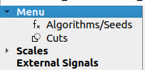
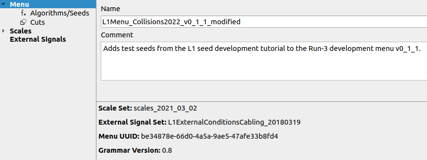

# TME tutorial: Exercise 3 ("Finalizing a L1 menu XML")

Once all seed modifications are completed and before submitting the L1 menu XML to the L1 menu team in form of a "L1 seed proposal", there are a few steps left to do to make a L1 menu XML file ready.

Most importantly, the customized L1 menu needs to be adequately named and provided with a comment that meaningfully summarizes the changes w.r.t. the reference L1 menu.

## Naming the customized L1 menu and summarizing the changes

To name your L1 menu and provide a descriptive comment, navigate to the Menu summary view by clicking "Menu" in the left-hand panel.

Fill the "Name" and "Comment" fields with descriptive text. As a minimum, the comment field should contain the name of the L1 menu that the customized XML is based on and a brief overview of the changes made w.r.t. to that L1 menu.

For the sake of this tutorial, here is a simple example:

Finally, save the L1 menu XML (). Eventually, also make sure that the XML file is named in accordance with the name provided in the "Name" field: "L1Menu_Collisions2022_v0_1_1_modified.xml"

**Congratulations - you just completed the TME tutorial!**

&rightarrow; Please proceed with the next tutorial part, the [L1 rate estimation](../rate-estimation/).
> NB: Don't worry if you did not manage to assemble the appropriate L1 menu XML file in this tutorial. The rate estimation tutorial will provide a suitable XML file for further processing.
